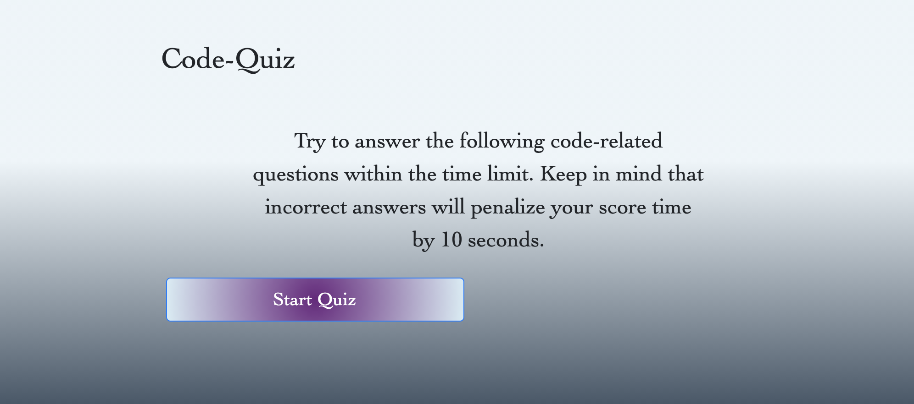
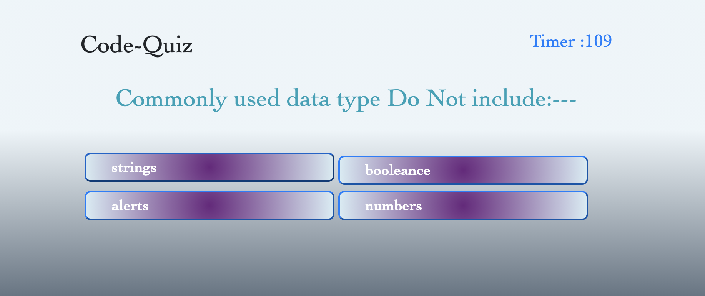
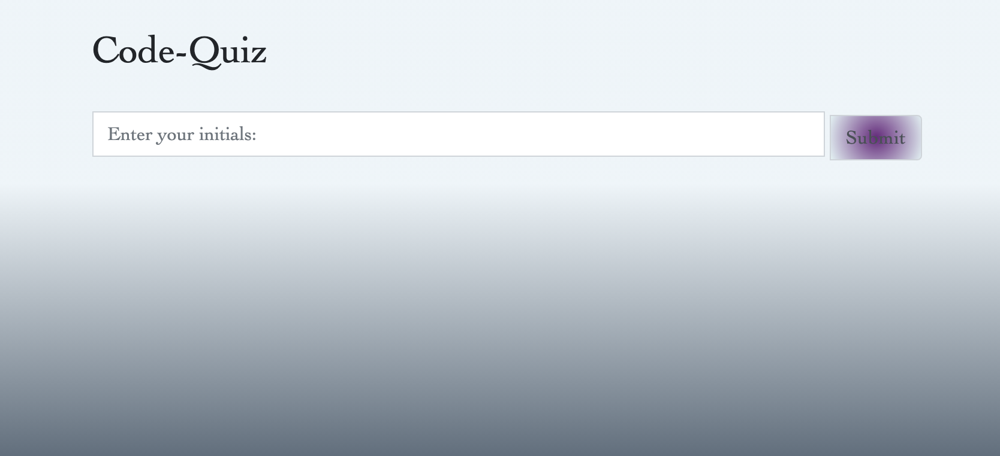
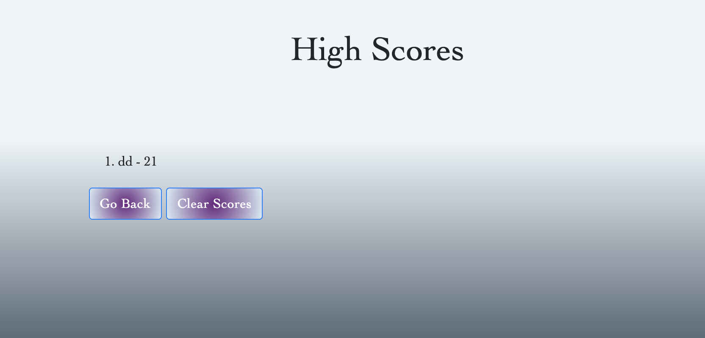

# Model - Employer Coding Assessment Quiz
- This is a multiple-choice coding quiz that I built to model a coding assessment. It's meant to familiarize myself with this type of assessment should I encounter it in the future. 

- In preperation for future full-stack web development interview processes, this coding quiz includes HTML, CSS, JS and Web-APIs to allow full functionality. 

- It is a basic representation of a coding assessment built to display within the browser, as opposed to a window prompt. The user will be prompted with several questions covering coding topics and be given an array of multiple choice answers that will include "click" functions. 

- These "click" functions will then be recorded and the final "score" will be stored in the local storage as "highscore" which includes a form to input user initials. 

- The coding assessment also includes a countdown timer that uitilizes the timerInterval function. This timer will give the user 115 seconds to answer the series of multiple choice questions. A "for loop" is included in the timerInterval function to add a decrement of 10 seconds for every question that is answered incorrectly. 

- Once the user has either finished answering the questions or the timer runs out, the user will then be prompted with a numerical value of how many questions they answered correctly. A form is included beneath it allowing the user to input their initals and click the SUBMIT button to store their "highscore" to local storage. 

- The user is able to take the coding assessment as many times as they would like; generating the "highscore" stats from highest to lowest value. 

- At some point in your journey to become a full-stack web developer, you’ll likely be asked to complete a coding assessment&mdash;perhaps as part of an interview process.

- A typical coding assessment includes both multiple-choice questions and interactive coding challenges. 

https://ddaghlas.github.io/Code-Quiz/

